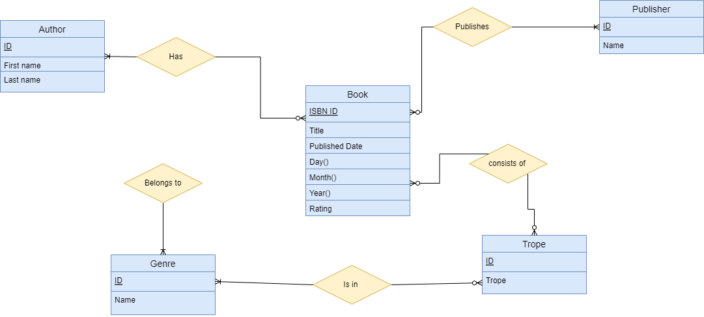

# Phase 1 documentation
## Problem: ## 

There is no database available that will help us look for a book based on their trope in a particular genre that would also show other information about the book such as the author name, publishing company and rating. 

## Background: ## 

Ever read a book and wanted to read another book with a similar story? Not just another book from the same genre but another book with a similar story line, tone and vibes. This is what we define as a trope. A trope is defined as “frequently used plot device in literature or art”. 

Every booklover has their own choice of genre that they usually like to go with. There’s hardly any bookworm who likes to read every sort of book that exists, including both fictional and non-fictional. On top of that, every genre has different tropes in recent days that makes it easier for the booklovers to make a decision if they want to read that book or not. However, these tropes are mostly not labeled when we are trying to buy a book and there is not any database available that would help us look for our favorite trope in a particular genre. For example, books in the romance genre can be divided into tropes like Enemies to Lovers, Beauty and the Beast, Bestfriends to lovers etc. Sometimes, we would also want to look for a book based on their genre, trope and rating. Having a database that would include all this information would certainly help all the booklovers who have to google search every single time they are looking for a new book. 

The goal of this database would be allowing the users to access a big list of books while filtering them out based on attributes like author name, genre, rating etc. The database will have a complete table with fictional and non fictional books. The table for books will include attributes such as the book title, published date, author name, genre, trope, rating and publisher name. Genre and trope will have their own entities with their ID and names as the attributes. An user will be able to filter out the book's name based on any of the attributes. 

The database can be accessed by any user across the globe. The book ratings will be accessing reliable databases from sites like Goodreads to show a book rating for the users.  Author names and IDs will be dependent on the Book Ids and the trope and genres will be linked to the book entity too. At the end of our project, we expect our users to be able to access the database as a whole and be able to sort out the lists with acceptable queries. 

## Queries: ##

1.  Display a list of books in the romance genre that has the trope “Enemies to Lovers”
2. Who are the top 10 writers known to write romance tragedies
3. What is the total number of books in the horror genre?
4. What are the last 5 books published by “Bloomsbury Publishing” 
5. Display the books published by “Grand Central Publishing” 
6. Display a list of Author first names in alphabetical order
7. Display the name of authors published by “Scholastic Inc”
8. What is the total number of tropes in the Action genre?
9. Display a list of books that has a rating higher than 3.5
10. What is the last book “John Green” author published?
11. List the Authors with “Time Traveling” from “Adventure” Genre
12. List books with both “Romance” and “Comedy”
13. List the Authors in the “Horror” genre whose books have a rating higher than 3.9
14. List the non-fiction books with “Adventure” trope
15. Who is the Author of “The fault in our stars” book
16. What is the latest book that got released that exists in the database?
17. What is the highest rated book in the database?
18. What is the highest rated book in the “Mystery” genre?
19. Count of books with genres “Romance” and “Mystery” together.
20. Display the books published in 2007 by “Riverhead Books”

## ER Diagram ##

## Relational Schemas ##
Publisher(Id, Name)

Book(ID, ISBN, Title, Date, Rating ) 

Date(Day, Month, Year) 

Author(ID, First Name, Last Name) 

Genre( ID, Name) 

Trope(ID, Trope) 

## Functional Dependencies ##

R( Book_ID, Title, Author_Id, Author_FirstName, Author_LastName, Genre_ID, Genre, Fiction_Or_Non, Trope_ID, Trope, Date, Month, Day, Year, PublishComp_Id ,Publish_Company, Rating)

Book_ID →  Title, Fiction_Or_Non, Date, Rating

Book_ID →→  Genre_ID

Book_ID, Genre_ID → → Trope_ID

Genre_ID → Genre

Date → Day, Month, Year

Trope_ID → Trope

PublishComp_ID → Publish_company

Author_Id → Author_FirstName, Author_Lastname

## Normalization ##
R( Book_ID, Title, Author_Id, Author_FirstName, Author_LastName, Genre_ID, Genre, Fiction_Or_Non, Trope_ID, Trope, Date, Month, Day, Year , Publish_comp_ID, Rating)

R1( Book_ID, Title, Author_Id, Genre_ID, Fiction_Or_Non, Trope_ID, Date, Publish_Company, Rating)

Genre(Genre_ID, Genre)

Author(Author_Id, Author_FirstName, Author_LastName)

Trope( Trope_ID, Trope)

Date(Date, Month, Day, Year)

Publisher( Publish_comp_ID, Publish_company)

Trope_TO_Genre(Trope_ID, Genre_ID)

Book(Book_ID, Title, Fiction_or_Non, Date, Publishing_Company, Rating)

Main(Book_Id, Author_Id, Genre_Id, Trope_Id)

## Authors ##

MAISHA MAHMOOD
PRAISY BIGUVU
